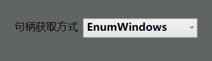

#### 很高兴遇见你
# 是否在为被人喷而烦恼，手速比不过对面
## 没事，QQWX自动轰炸帮你解决

- 采用windwos原生接口，自动发送信息
-enum/findwindow任你选择
- 采用json方式的数据存储方便添加与删除/自定义

# 使用方法
-  [下载QQWX自动轰炸](https://github.com/whyxiaoxing/qqwxbiubiubiu/commits/v1.0.0)
- 在安装目录下，运行net9运行时.exe
- 运行程序后是这样的

- 输入轰炸对象，轰炸次数，点击启动，就可以简单的实现轰炸了
- 出现无法发送，轰炸的情况更换鼠标点击模式或者
>

句柄获取方式,即可正常运行
仍然出现此类问题，请反馈至开发群，并携带日志信息
>
# 注意事项
- 请合理使用该程序
- 因使用本程序导致的封号，禁用开发者不负责
- 友好发言是不产生冲突的前提，请友善交流

# 开发群
-